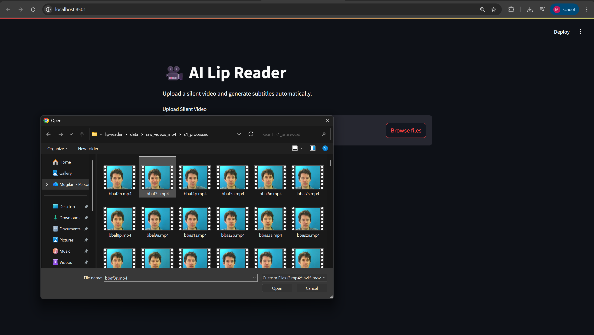
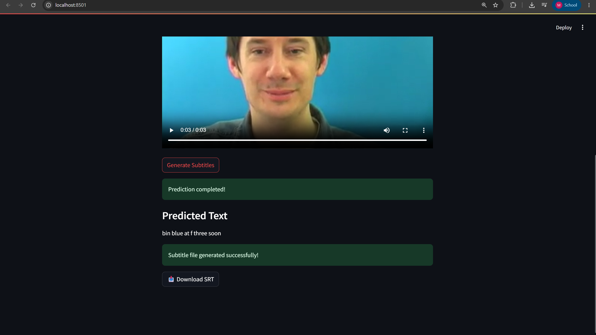
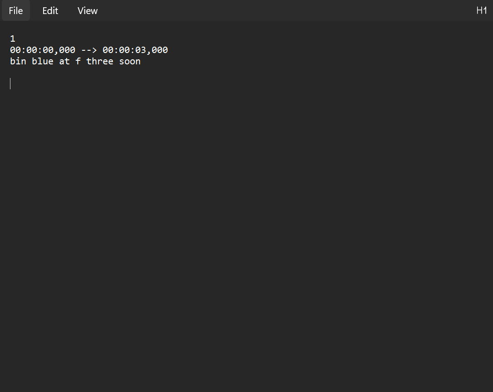

# 🎯 AI Lip Reader

AI-powered lip reading system that converts silent videos into text transcripts and downloadable subtitle files (.srt).

## 🚀 Demo

📹 Full Project Demonstration

https://drive.google.com/file/d/1yTKMR-n57uhGuUfvYZJBQRt0HNGkx8q4/view?usp=sharing

---

## 📌 Features

* Upload silent videos through a Streamlit web interface
* Automatic face and lip detection using MediaPipe
* Lip sequence preprocessing pipeline
* Deep Learning based Lip Reading Model (LipNet-style architecture)
* Subtitle generation (.srt)
* GPU accelerated training with PyTorch
* Real-time prediction through a web application

---

## 🖼️ Screenshots

### Upload Video



### Prediction Output



### Subtitle Generation



---

## 🏗️ Project Architecture

Video Input

↓

Face Detection (MediaPipe)

↓

Lip Region Extraction

↓

Frame Preprocessing

↓

Lip Reading Model (PyTorch)

↓

CTC Decoding

↓

Text Prediction

↓

SRT Subtitle Generation

---

## 🧠 Tech Stack

### Machine Learning

* PyTorch
* NumPy

### Computer Vision

* OpenCV
* MediaPipe

### Web Application

* Streamlit

### Dataset

* GRID Corpus Dataset

---

## 📂 Project Structure

```text
lip-reader/
├── app/
├── data/
├── models/
├── src/
│   ├── preprocessing/
│   ├── model/
│   ├── inference/
│   └── utils/
├── screenshots/
├── requirements.txt
└── README.md
```

## 📊 Evaluation Results

Sample Evaluation Results:

| Ground Truth             | Prediction               |
| ------------------------ | ------------------------ |
| bin red with m two again | bin red with m two again |
| set red in d nine soon   | set red in d nine soon   |
| lay white in k six again | lay white in k six again |
| place blue in f six soon | place blue in f six soon |

Observed accuracy on sampled test videos:

* 18/20 videos perfectly predicted
* Minor errors typically involve visually similar letters
* Strong performance on GRID vocabulary sentences

---

## ⚙️ Installation

Clone the repository:

```bash
git clone https://github.com/mugilansGIT/AI-Lip-Reader.git
cd AI-Lip-Reader
```

Install dependencies:

```bash
pip install -r requirements.txt
```

---

## ▶️ Run the Application

```bash
streamlit run app/app.py
```

Open:

```text
http://localhost:8501
```

Upload a video and generate subtitles.

---

## 🎓 Training Details

* Dataset: GRID Corpus
* Processed Samples: ~33,000
* Framework: PyTorch
* GPU: NVIDIA RTX 4060 Laptop GPU
* Loss Function: CTC Loss
* Decoder: Greedy CTC Decoder

---

## 🔮 Future Improvements

* Real-time webcam lip reading
* Beam Search Decoder
* Transformer-based lip reading models
* Speaker-independent evaluation
* Cloud deployment

---

## 👨‍💻 Author

Mugilan

Artificial Intelligence and Data Science Engineering Student

Interested in:

* Artificial Intelligence
* Computer Vision
* Data Science
* Machine Learning
